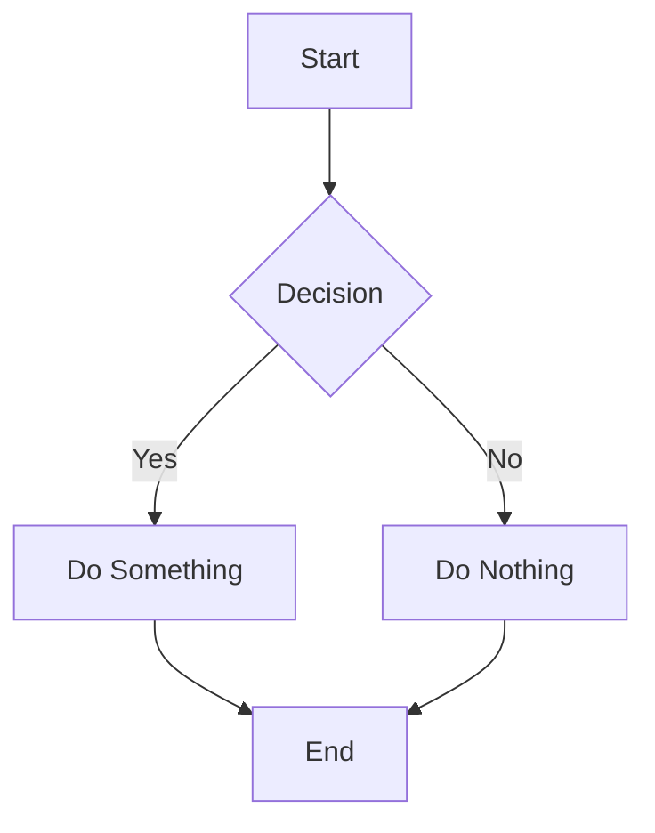

# Full Syntax (MDX rendering)

## Text Formatting

**Bold text**, *italic text* and ***bold italic text***

~~Strikethrough text~~

==Highlighted text==

## Lists

Unordered list:
* Item 1
* Item 2
  * Nested item 2.1
  * Nested item 2.2
* Item 3

Ordered list:
1. First item
2. Second item
   1. Nested item 2.1
   2. Nested item 2.2
3. Third item

## Task Lists

- [x] Completed task
- [ ] Incomplete task
- [ ] Another task
  - [x] Nested completed task
  - [ ] Nested incomplete task

## Code Blocks

Inline code: `const greeting = "Hello, World!";`

Code blocks:
```javascript
// JavaScript example
function calculateSum(a, b) {
  return a + b;
}
const result = calculateSum(5, 3);
console.log(result); // Output: 8
```

```python
# Python example
def greet(name):
    return f"Hello, {name}!"
print(greet("Flowershow"))
```

## Tables

| Book Type | Average Length | Reading Time |
|-----------|---------------|--------------|
| Novel | 300 pages | 5 hours |
| Magazine | 50 pages | 1 hour |
| Comic Book | 30 pages | 30 minutes |
| Cookbook | 200 pages | 2 hours |

## Blockquotes

> Single line quote

> Multi-line quote
> with multiple paragraphs
> > Nested quote
> > > Deeper nested quote

## Links & Embeds

Regular markdown (CommonMark) link:
```md
[Visit Flowershow](https://flowershow.app)
```
→ [Visit Flowershow](https://flowershow.app)

Regular markdonw (CommonMark) image embed:
```md

```
→


### Obsidian Wiki-links

Flowershow supports **Obsidian-style wiki-links** too.

**Shortest-possible path:**
```md
[[post-1]]
```
→ [[post-1]]

**Absolute path:**
```md
[[blog/post-1]]
```
→ [[blog/post-1]]

**With an alias:**
```md
[[post-1|Alias]]
```
→ [[post-1|Alias]]

**File embeds:**
```md
![[image.jpg]]
```
→ 
![[image.jpg]]

### Math Equations

```
Lift($$L$$) can be determined by Lift Coefficient ($$C_L$$) like the following
equation.

$$
L = \frac{1}{2} \rho v^2 S C_L
$$
```

Lift($$L$$) can be determined by Lift Coefficient ($$C_L$$) like the following
equation.

$$
L = \frac{1}{2} \rho v^2 S C_L
$$

### Mermaid Diagrams



### Obsidian Callouts

> [!NOTE]
> This is a note callout

> [!WARNING]
> This is a warning callout

> [!BUG]
> This is a bug callout

> [!IMPORTANT]
> This is an important callout

### PDF Embeds

`![[sample.pdf]]`

![[sample.pdf]]

### Footnotes

Here's a sentence with a footnote[^1].

[^1]: This is the footnote content.

## MDX special characters

In **MDX rendering** only these should render without an error (Flowershow auto-escapes them):
- 50 < 100 <100 <= 100 => 100> 100 > 50

But these would throw an error:
```
- <a, b>
- {a, b}
```

## JSX blocks

```
<span style={{ color: 'tomato', fontWeight: 'bold' }}>This text is red and bold.</span>
```

<span style={{ color: 'tomato', fontWeight: 'bold' }}>This text is red and bold.</span>

With Tailwind:

```
<span className="text-blue font-bold">This text is red and bold.</span>
```

<span className="text-blue font-bold">This text is red and bold.</span>


